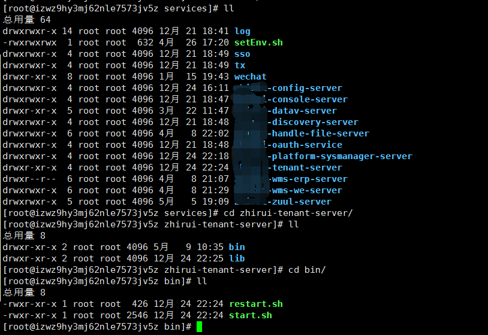

# 微服务环境搭建--系统环境变量方式
## 1.开发环境：
* 在我的电脑配置环境变量
* idea服务节点环境配置的VM options可以配置环境变量(推荐)：
```ruby
-Dmultipart-location=D:/wms/temp
-DDiskLocation=D:/wms/
-DWMS_CONFIG_SERVER_URL=http://192.168.1.xx:8861
-DWMS_EUREKA_SERVER_URL=http://192.168.1.xx:8090/eureka/
-WMS_DEVELOPER_NAME=-yehuiqun
-Dconfig.profile=dev
```

## 2.生产环境：
### 2.1.部署目录：

每个服务部署在/XXX/services/下。
每个服务单独一个目录。
每个目录下又有一个bin和lib文件夹。
bin下面有两个文件`restart.sh`, `start.sh`。
lib下为springboot打的jar包。可以通过jinkens编译到该目录中。bin下`start.sh`或者`restart.sh`会随机选择一个该目录下的jar包启动。
### 2.2.配置环境变量类`setEnv.sh`：
```shell
[root@izwz9hy3mj62nle7573jv5z services]# vim setEnv.sh
#!/bin/bash
source ~/.bash_profile
export BUILD_ID=dontkillme
# for jdk env
#export JAVA_HOME=/usr/jdk1.8.0_112
#export PATH=$JAVA_HOME/bin:$JAVA_HOME/jre/bin:$PATH
#export CLASSPATH=$JAVA_HOME/lib:$JAVA_HOME/jre/lib:$CLASSPATH
# for jcdz app
export ENV_OPTS="-Dconfig.profile=pro"
export WMS_EUREKA_SERVER_URL="http://172.18.81.220:8090/eureka/"
export WMS_CONFIG_SERVER_URL="http://172.18.81.220:8861"
export WMS_DEVELOPER_NAME=""
export WMS_CONFIG_GIT_USER="config-read"
export WMS_CONFIG_GIT_PWD="config-read"
export WMS_CONFIG_GIT_URI="http://120.79.246.166:7560/config/config-file.git"
export WMS_CONFIG_GIT_SEARCHPATHS="pro"
```
### 2.3.启动脚本为`start.sh`：
 会加载环境变量setEnv.sh
```shell
#!/bin/bash
source ~/.bash_profile
echo "Sping Cloud ops script.wms" 

function green() {
    echo -e "\033[32m$1 \033[0m"
}

function red() {
    echo -e "\033[31m$1 \033[0m"
}

# set dir
cd `dirname $0`
DISK_DIR=/wms/logs
BIN_DIR=`pwd`
DEPLOY_DIR=`cd ..;pwd`
CONF_DIR=${DEPLOY_DIR}/conf
LIB_DIR=${DEPLOY_DIR}/lib
LOGS_DIR=${DEPLOY_DIR}/logs
LOGS_ROOTPATH=${DISK_DIR}/${SERVER_NAME}


# set env
source $DEPLOY_DIR/../setEnv.sh
# check config

# set APP's OPT
JAR_NAME="`ls ${LIB_DIR} | grep .jar | sort -nr | head -1`"
# for jcdz project
RUN_JAR_PATH=${LIB_DIR}/${JAR_NAME}
# echo desc
echo "################################################################################"
java -version
echo "JAVA_HOME=$JAVA_HOME"
echo "DEPLOY_DIR=$DEPLOY_DIR"
echo "RUN_JAR_PATH=$RUN_JAR_PATH"
echo "################################################################################"

# check process
PIDS=`ps -ef | grep java | grep "$LIB_DIR" |awk '{print $2}'`
if [ -n "$PIDS" ]; then
    red "ERROR: The [$DEPLOY_DIR:$SERVER_NAME] already started! PID is $PIDS!"
    exit 1
fi

#init log
ERROR="-Dpro.log.level=ERROR"


# init logs dir

if [ ! -d $LOGS_ROOTPATH ]; then
    mkdir -p $LOGS_ROOTPATH
fi

JAVA_OPTS="${ENV_OPTS} -Djava.awt.headless=true -Djava.net.preferIPv4Stack=true -Dfile.encoding=UTF-8"

JAVA_DEBUG_OPTS=""
if [ "$1" = "debug" ]; then
    JAVA_DEBUG_OPTS=" -Xdebug -Xnoagent -Djava.compiler=NONE -Xrunjdwp:transport=dt_socket,address=8000,server=y,suspend=n "
fi
JAVA_JMX_OPTS=""
if [ "$1" = "jmx" ]; then
    JAVA_JMX_OPTS=" -Dcom.sun.management.jmxremote.port=1099 -Dcom.sun.management.jmxremote.ssl=false -Dcom.sun.management.jmxremote.authenticate=false "
fi
JAVA_MEM_OPTS=""
BITS=`java -version 2>&1 | grep -i 64-bit`
if [ -n "$BITS" ]; then
    JAVA_MEM_OPTS=" -server -Xms512m -Xmx512m -XX:MaxMetaspaceSize=512m -Xss256k -XX:+DisableExplicitGC -XX:+UseConcMarkSweepGC -XX:+CMSParallelRemarkEnabled -XX:LargePageSizeInBytes=128m -XX:+UseFastAccessorMethods -XX:+UseCMSInitiatingOccupancyOnly -XX:CMSInitiatingOccupancyFraction=70 "
else
    JAVA_MEM_OPTS=" -client -Xms512m -Xmx512m -XX:MaxMetaspaceSize=512m  -XX:SurvivorRatio=2 -XX:+UseParallelGC "
fi

green "Starting the $SERVER_NAME ...\c"
nohup java -Dlog.rootPath=$LOGS_ROOTPATH $ERROR $JAVA_OPTS $JAVA_MEM_OPTS  -jar $RUN_JAR_PATH > /dev/null 2>&1 &
green "OK! \c"
PIDS=`ps -ef | grep java | grep "$LIB_DIR" | awk '{print $2}'`
green "PID: $PIDS"
green "LOGS_FILE: $LOGS_ROOTPATH"
```
### 2.4.重启脚本为`restart.sh`：
```shell
#!/bin/bash

function green() {
    echo -e "\033[32m$1 \033[0m"
}

function red() {
    echo -e "\033[31m$1 \033[0m"
}

DEPLOY_DIR=`cd ..;pwd`
LIB_DIR=${DEPLOY_DIR}/lib


echo "${LIB_DIR}"


# check process
PIDS=`ps -ef | grep java | grep "${LIB_DIR}" |awk '{print $2}'`
if [ -n "$PIDS" ]; then
    red "ERROR:  already started! PID is $PIDS!"
    kill -9 "$PIDS"
    green "正在重新启动。。。"
fi

sh ./start.sh
```


### 2.5.编写启动shell脚本
上文的`start.sh`和`restart.sh`脚本在命令行中难以操作，故编写下面这个类用于简便启动和重启。
```shell
#!/bin/bash

LIB_DIR=../lib/
JAR_NAME=zhirui-wms-we-server-0.0.1-SNAPSHOT.jar
LOG_DIR=/wms/logs/we/
JAR_PATH=zhirui-wms-we-server/
JAR_DIR=/wms/services/

function green() {
    echo -e "\033[32m$1 \033[0m"
}

function red() {
    echo -e "\033[31m$1 \033[0m"
}

#PIDS=`ps -ef | grep java | grep "$JAR_NAME" |awk '{print $2}' | xargs kill -9`

#查找到服务的进程id,判断是否需要kill
PIDS=`ps -ef | grep java | grep "$JAR_NAME" |awk '{print $2}'`
if [ -n "$PIDS" ]; then
    read -p "service process is active, are you kill it(default is no)?(y/n):" flag
    if [[ "$flag"x = "n"x ]] || [[ "$flag"x = "no"x ]]; then
        red "Cancel start! The [$JAR_NAME] already started! PID is $PIDS!"
        exit 1
    elif [[ "$flag"x = "y"x ]] || [[ "$flag"x = "yes"x ]]; then
        red "will kill the serive [$JAR_NAME]"
    else
        echo "no select"
        exit 1
    fi

    kill -9 $PIDS
    echo "kill $JAR_NAME ok...., PID is $PIDS"

fi

#开始启动服务
echo "start $JAR_NAME"
#nohup java -jar -Xms258m -Xmx258m -XX:PermSize=512M -XX:MaxPermSize=512m ${LIB_DIR}/${JAR_NAME} > /dev/null &
${JAR_DIR}${JAR_PATH}/bin/start.sh

#找到最新的log进行打印到console
PIDS=`ps -ef | grep java | grep "$JAR_NAME" |awk '{print $2}'`
green "Start success!"
green "PID: $PIDS"
green "LOGS_FILE: $LOGS_ROOTPATH"
#判断是否需要查看实时日志
read -p "Are you show log timely(default is yes)?(y/n):" flag
if [[ "$flag"x = "n"x ]] || [[ "$flag"x = "no"x ]]; then
        exit 1
fi
#休眠3秒，否则可能找到的日志文件不是最新的
sleep 3
#开始打印实时日志
tail -f $LOG_DIR`ls -lt $LOG_DIR | grep .log | head -n 1 |awk '{print $9}'`
```